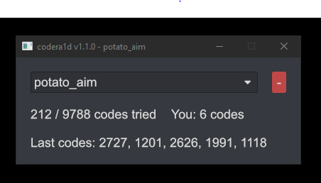
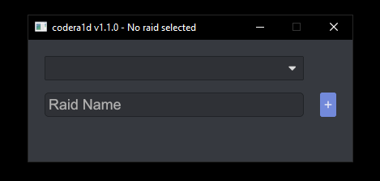

# Codera1d Client

`codera1d-client` is a program allowing collaborative, assisted code raiding
in Rust. It requires a separate [`codera1d-server`](https://github.com/sammauldin/codera1d-server).

It has the following features:

- Shared progress: You won't try duplicate codes with other raiders.
- Pin priority: A sorted pin code list ensures that you are trying to most common codes first.
- History: If you get the correct code, you can see which codes were recently tried.

## Building

Set the `CODERA1D_ENDPOINT` and `CODERA1D_API_KEY` environment variables
before building.

## Usage

Create a new raid on the initial screen, switch to it, then press tilde
while looking at a code lock entry screen. Repeat until the base is yours.

## Can I get banned for this?

Probably.
